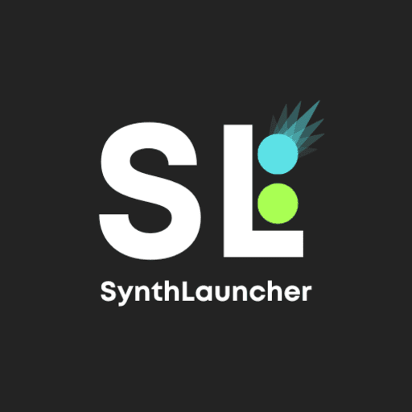
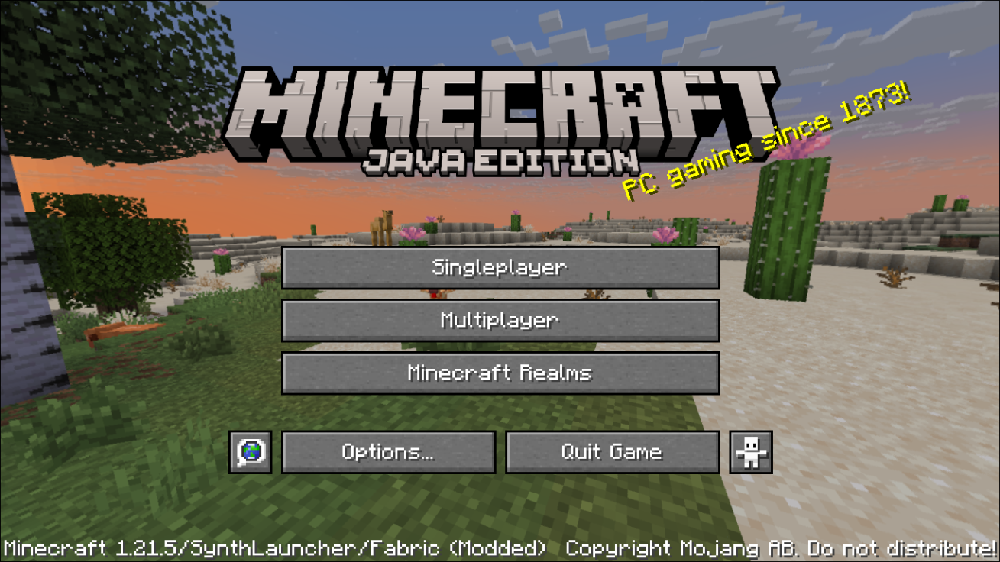
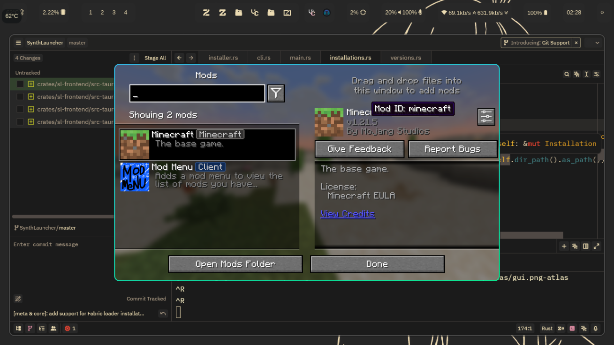
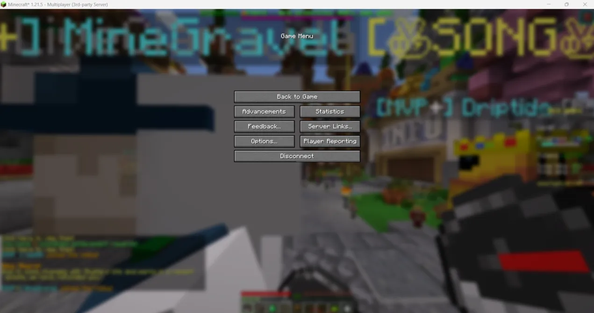
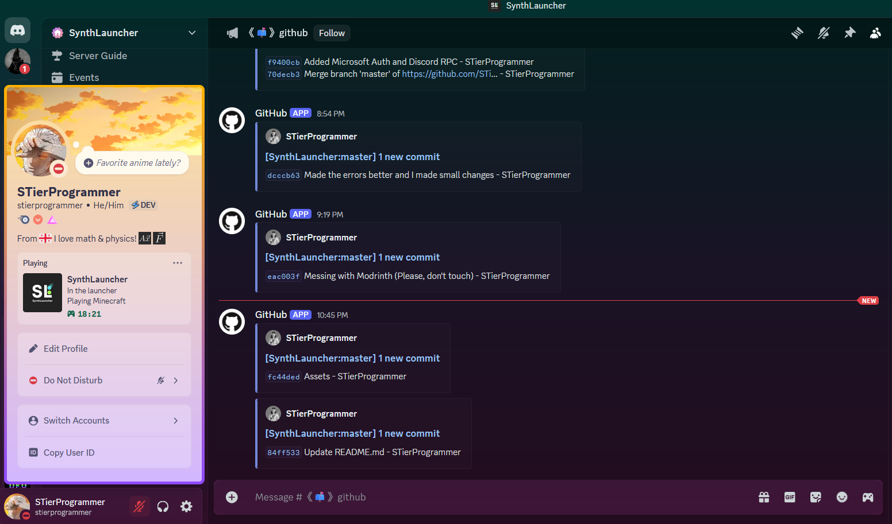

# SynthLauncher

**SynthLauncher** is an open-source Minecraft launcher. Our goal is to provide a seamless, optimized experience that enhances performance across all types of systems. Currently, the launcher is in active development, and we welcome contributions from the community.

## Features

- **Optimized Performance:** We’re focused on maximizing performance, reducing load times, and minimizing resource usage to ensure a smooth Minecraft experience.
- **Open-Source:** SynthLauncher is completely open-source, and we encourage contributions from developers who share our vision.

> [!NOTE]
> We will be implementing more features!

## Current Status

1. **Added Fabric Loader:**

2. **Added Microsoft Auth:**

3. **Added Discord RPC:**

4. **Sound fixes for older versions**

## Contributing

We appreciate and welcome contributions! If you’re interested in helping out, please fork the repository, make your changes, and submit a pull request. Whether you’re fixing bugs, optimizing performance, or adding new features, your contributions are valuable.

### How to Contribute

1. Fork the repository.
2. Create a new branch for your feature or fix.
3. Make your changes and test them.
4. Submit a pull request with a detailed description of your changes.

> [!NOTE]
> If you want to join the team, please contact STierProgrammer.

## Contact

If you have any questions or need further assistance, feel free to reach out to us via the project's issue tracker, Email: [STierProgrammer@gmail.com](mailto:stierprogrammer@gmail.com) or Discord: `stierprogrammer`.

### Inspired by:

1. [CrabLauncher](https://github.com/safiworks/CrabLauncher)
2. [QuantumLauncher](https://github.com/Mrmayman/quantum-launcher)
3. [SmallLauncher](https://github.com/smallauncher/smallauncher)

---

## **SynthLauncher** - A Minecraft Launcher for Everyone
